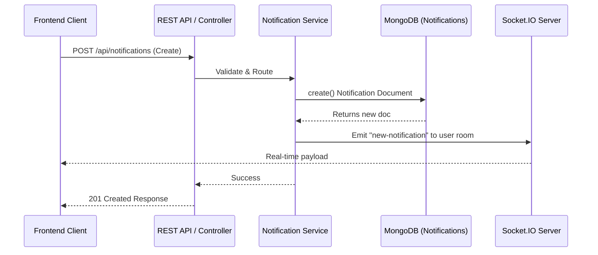

# Notifications API & WebSocket Architecture Reference

Last Updated: June 28, 2026

Welcome to the comprehensive documentation for the SkillsSphere-AI Notifications System. This document covers the complete RESTful API interface, WebSocket integration, data modeling, authentication flows, error handling, rate limiting, and developer guidelines for building and integrating notification features into the platform.

---

## Table of Contents

1. [System Architecture](#system-architecture)
2. [Data Model & Schema](#data-model--schema)
3. [Security & Authentication](#security--authentication)
4. [Rate Limiting & Throttling](#rate-limiting--throttling)
5. [REST API Endpoints](#rest-api-endpoints)
    - [GET /api/notifications](#list-notifications)
    - [GET /api/notifications/unread-count](#get-unread-count)
    - [POST /api/notifications](#create-notification)
    - [GET /api/notifications/:id](#get-notification-by-id)
    - [PATCH /api/notifications/:id/read](#mark-notification-as-read)
    - [PATCH /api/notifications/mark-all/read](#mark-all-notifications-as-read)
    - [DELETE /api/notifications/:id](#delete-notification)
    - [DELETE /api/notifications/bulk](#delete-multiple-notifications)
    - [DELETE /api/notifications](#delete-all-notifications)
6. [WebSocket Integration](#websocket-integration)
    - [Connection Lifecycle](#connection-lifecycle)
    - [Real-time Events](#real-time-events)
7. [Pagination, Filtering, and Sorting](#pagination-filtering-and-sorting)
8. [Error Handling & Status Codes](#error-handling--status-codes)
9. [Integration Examples (cURL, Node.js, Python)](#integration-examples)
10. [Developer Guidelines](#developer-guidelines)

---

## System Architecture

The Notifications system is built to provide scalable, real-time, and persistent alerts to users across the platform. It leverages **MongoDB** for persistent storage and **Socket.io (WebSockets)** for low-latency delivery to connected clients.

### High-Level Flow Diagram



### Components
1. **Controller Layer**: Handles REST HTTP requests, runs Zod validation (e.g., `createNotificationSchema`), sanitizes URLs, and protects routes.
2. **Service Layer**: Decoupled business logic responsible for complex data aggregation, interacting with Mongoose, and triggering WebSocket events.
3. **WebSocket Layer**: `socket.js` listens to authenticated clients, maps sockets to user-specific rooms (e.g., `user_<id>`), and handles live delivery.
4. **Data Layer**: The Mongoose `Notification` model defines the schema, indexing rules, and enumeration bounds for `type` validation.

---

## Data Model & Schema

Every notification follows a strict schema designed to enforce data integrity while allowing extensible metadata for varying domain contexts (jobs, applications, chat).

### Core Fields

| Field | Type | Required | Constraints / Default | Description |
| --- | --- | --- | --- | --- |
| `_id` | `ObjectId` | Yes | Auto-generated | Unique identifier. |
| `userId` | `ObjectId` | Yes | Indexed | The recipient of the notification. |
| `title` | `String` | Yes | 2-200 chars, Trimmed | The primary bolded text of the notification. |
| `message` | `String` | Yes | Min 5 chars, Trimmed | The detailed body of the notification. |
| `type` | `String` | Yes | Enum Validated | The categorical type determining UI icon/color. |
| `isRead` | `Boolean` | No | Default: `false`, Indexed | Read state of the notification. |
| `metadata` | `Object` | No | Optional, Validated | Routing and relational context (see below). |
| `relatedData` | `Mixed` | No | Schema.Types.Mixed | Flexible payload for cross-module features. |
| `createdAt` | `Date` | Yes | Auto-generated, Indexed | The timestamp of creation. |
| `updatedAt` | `Date` | Yes | Auto-generated | The timestamp of last modification. |

### Allowed Notification Types (`type` Enum)

The `type` field is strictly enforced by both Zod and Mongoose. Sending an invalid type yields a 400 Bad Request.

- **Status Updates**: `application`, `new_application`, `application_status`
- **User Alerts**: `skill_gap_alert`, `job-update`, `interview`
- **System / General**: `info`, `warning`, `success`, `error`, `system`, `message`

### Metadata Object (`metadata`)

Used primarily by the frontend to navigate the user when clicking a notification.

```json
{
  "relatedId": "665b67a54dc0...",
  "relatedModel": "JobPosting", 
  "actionUrl": "/jobs/view/1234"
}
```

> **Security Note:** The `actionUrl` is sanitized by the controller via `isSafeNotificationActionUrl()` to prevent XSS payloads like `javascript:alert(1)`.

---

## Security & Authentication

### 1. REST Authentication
Every endpoint under `/api/notifications` requires a valid JWT. The route is protected by the `protect` middleware.

**Header Format:**
```http
Authorization: Bearer <token_string>
```

### 2. Authorization Rules
Users are strictly isolated to their own records.
- You can **only GET** notifications where `userId` matches your own `req.user._id`.
- You can **only DELETE or PATCH** your own notifications.
- **POST (Creation)**: Normally users can only create notifications for themselves unless they are an admin.

### 3. WebSocket Authentication
Real-time connections use the Socket.IO `auth` handshake.
```javascript
const socket = io("wss://api.example.com", {
  auth: { token: "eyJhbG..." }
});
```
The server validates the JWT and attaches `socket.user`. The client then explicitly joins their private room by emitting `join-notifications`.

---

## Rate Limiting & Throttling

The API leverages `express-rate-limit` globally and specifically for high-traffic routes to prevent abuse.

| Endpoint | Limit | Window | Consequence |
| --- | --- | --- | --- |
| `GET /api/notifications` | 300 requests | 15 mins | HTTP 429 Too Many Requests |
| `POST /api/notifications` | 300 requests | 15 mins | HTTP 429 Too Many Requests |

---

## REST API Endpoints

### List Notifications
Retrieves a paginated list of notifications for the authenticated user.

**Endpoint:** `GET /api/notifications`

**Query Parameters:**
- `page` (number, default: 1): The page to retrieve.
- `limit` (number, default: 20): Items per page.
- `isRead` (boolean, optional): Filter by `true` or `false`.
- `type` (string, optional): Filter by an exact type enum or by groups (e.g., `jobs`, `interviews`, `system`).

**Example Response:**
```json
{
  "success": true,
  "data": [
    {
      "_id": "665b673d4dc...",
      "title": "Application Updated",
      "message": "Your application to Acme Corp was viewed.",
      "type": "application_status",
      "isRead": false,
      "createdAt": "2026-06-28T10:30:00.000Z"
    }
  ],
  "pagination": {
    "page": 1,
    "limit": 20,
    "total": 42,
    "pages": 3
  },
  "message": "Notifications retrieved successfully"
}
```

---

### Get Unread Count
Returns a lightweight integer representing the user's unread notifications badge count.

**Endpoint:** `GET /api/notifications/unread-count`

**Example Response:**
```json
{
  "success": true,
  "data": { "unreadCount": 12 },
  "message": "Unread count retrieved successfully"
}
```

---

### Create Notification
Creates a new notification. This automatically broadcasts the event to the user's active WebSocket room.

**Endpoint:** `POST /api/notifications`

**Payload:**
```json
{
  "userId": "665b65d6...",
  "title": "Interview Scheduled",
  "message": "Please review the calendar invite for tomorrow.",
  "type": "interview",
  "metadata": {
    "actionUrl": "/interviews/view/665b67a5"
  }
}
```

---

### Get Notification by ID
Retrieves a specific notification by its unique ID.

**Endpoint:** `GET /api/notifications/:id`

---

### Mark Notification as Read
Flips the `isRead` boolean to `true`.

**Endpoint:** `PATCH /api/notifications/:id/read`

---

### Mark All Notifications as Read
Bulk updates every unread notification owned by the user to `isRead: true`.

**Endpoint:** `PATCH /api/notifications/mark-all/read`

---

### Delete Notification
Deletes a single notification record permanently.

**Endpoint:** `DELETE /api/notifications/:id`

---

### Delete Multiple Notifications
Bulk deletes a specific subset of notifications via an array of IDs.

**Endpoint:** `DELETE /api/notifications/bulk`

**Payload:**
```json
{
  "ids": ["665b673d...", "665c891a..."]
}
```

---

### Delete All Notifications
Permanently deletes all notifications belonging to the authenticated user.

**Endpoint:** `DELETE /api/notifications`

---

## WebSocket Integration

The system uses Socket.io to push live notifications to active clients, avoiding the need for continuous polling.

### Connection Lifecycle

1. **Connect & Authenticate**: The client connects passing a valid JWT in the handshake.
2. **Join Private Room**: The client emits `join-notifications`. The backend server attaches the socket to the `user_{userId}` room, ensuring only the authenticated user receives their events.
3. **Listen for Events**: The client listens for the `new-notification` event to trigger UI toasts and update unread badges.

### Code Example (Frontend React/TS)

```typescript
import { io } from "socket.io-client";

const socket = io(process.env.REACT_APP_API_URL, {
  auth: { token: localStorage.getItem("token") }
});

socket.emit("join-notifications");

socket.on("new-notification", (notification) => {
  console.log("Live Alert:", notification.title);
  toast.info(notification.message);
  incrementBadgeCount();
});
```

---

## Pagination, Filtering, and Sorting

- **Sorting**: By default, all queries are hardcoded in `service.js` to sort by `createdAt: -1` (newest first).
- **Filtering**: The `GET /api/notifications` endpoint implements grouped filtering. If you pass `?type=jobs`, the backend expands this to filter `$in: ["job-update", "application", "new_application"]`. Passing `?type=system` groups system alerts, error alerts, and skill gap alerts.
- **Pagination**: Uses `page` and `limit` paradigms, returning `total` documents and computed `pages` in the response envelope.

---

## Error Handling & Status Codes

The API uses structured, predictable error responses, enforced globally by `AppError` and the error middleware.

### 400 Bad Request
Triggered by Zod validation failures or malformed Object IDs.
```json
{
  "success": false,
  "status": "fail",
  "message": "Validation failed",
  "errors": {
    "type": "Type must be one of: info, warning, success, error, job-update, interview, application, new_application, skill_gap_alert, application_status, system, message"
  }
}
```

### 401 Unauthorized
Triggered when the JWT is missing, expired, or tampered with.

### 403 Forbidden
Triggered if you attempt to GET, PATCH, or DELETE a notification ID that belongs to another user.

### 404 Not Found
Triggered if the requested notification ID does not exist in the database.

---

## Integration Examples

### Node.js (Fetch API)
```javascript
async function fetchUnreadNotifications(token) {
  const response = await fetch("https://api.example.com/api/notifications?isRead=false&limit=5", {
    headers: {
      "Authorization": `Bearer ${token}`
    }
  });
  const json = await response.json();
  return json.data;
}
```

### Python (Requests)
```python
import requests

def mark_all_read(token):
    headers = {"Authorization": f"Bearer {token}"}
    response = requests.patch(
        "https://api.example.com/api/notifications/mark-all/read",
        headers=headers
    )
    return response.json()
```

---

## Developer Guidelines

1. **Avoid Polling**: Never poll `GET /api/notifications/unread-count` on an interval. Connect via WebSockets and wait for the `new-notification` broadcast to update your frontend state.
2. **Metadata Links**: Always use relative URLs (e.g., `/jobs/123`) in the `metadata.actionUrl` payload to ensure frontend framework routers (like React Router) handle the navigation gracefully without full page reloads.
3. **Data Sanitization**: The API will strip malicious payloads from `actionUrl`. If a notification appears but clicking it does nothing, ensure the URL doesn't contain JavaScript protocols or invalid control characters.
4. **Soft Deletions vs Hard Deletions**: The `DELETE` endpoints are hard deletions. Once removed, they cannot be recovered. For temporary dismissals, consider using the `isRead` flag and filtering them out in the UI.
